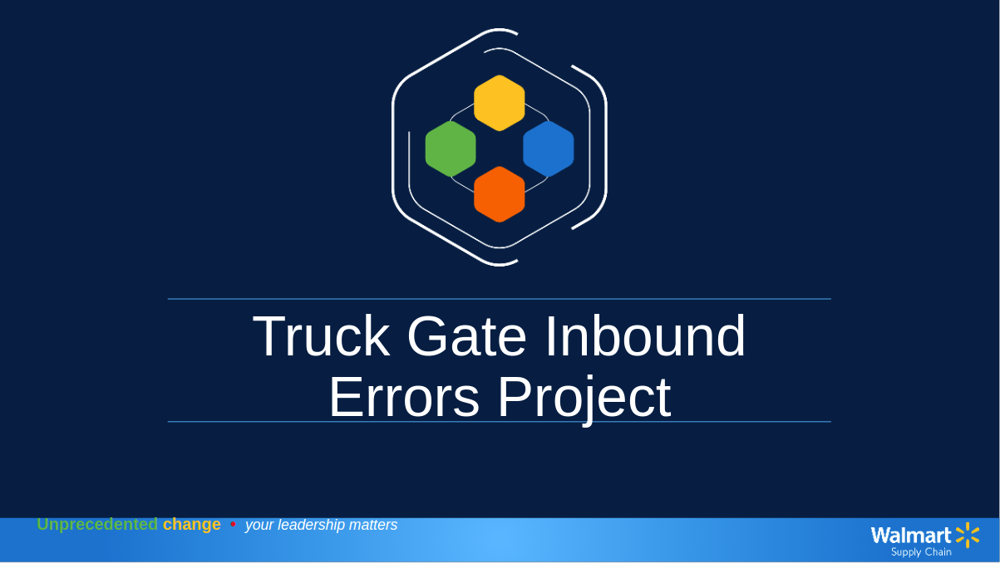

# Walmart Supply Chain Projects

Projects and work from my time with Walmart Supply Chain.
These projects were not part of my core job duties and required me to optimize my core duties in order to have time to tackle the problems that these projects address.

## AP Staffing Project

### [>>> Link to Project <<<](./AP_Staffing_and_Scheduling.pdf)

Used data analysis in order to design an optimal employee schedule that best meets both stable and variable work requirements. Made it possible to reduce labor costs to meet new company goals while improving customer service as well as decreasing employee stress levels and related quality issues. 

  

## Truck Gate Errors Project

### [>>> Link to Project <<<](./Truck_Gate_Inbound_Errors.pdf)

Investigation into and recommendations concerning an opportunity to improve upon ongoing high error rates during a truck inbounding process within a distribution center.

  
