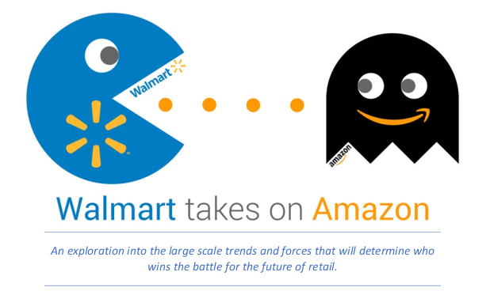

# Walmart Supply Chain Projects

Projects and work related to my time with Walmart Supply Chain.
The AP Staffing and Truck Gate Errors projects were created during my time with Walmart that were created above and beyond my normal job duties.
The Walmart Vs. Amazon project was a personal project that was created entirely during my free time.

## Walmart Vs. Amazon - 30000 Foot View

### [>>> Link to Project <<<](./Walmart_vs_Amazon_Project.pdf)

Broad non-technical overview and storyline about the competition between Walmart and Amazon. Starts out as a high level overview and gradually works into more specific problems and potential solutions near the end.
Disclaimers: This story was created in early 2018 and a lot of the content is specific to that time period. The value I was attempting to bring with this project was organizing a high level overview and story from existing publicly available materials. Very few of the specific graphs and images were created by myself and I claim no credit for any of these materials. 

  

## AP Staffing Project

### [>>> Link to Project <<<](./AP_Staffing_and_Scheduling.pdf)

Used data analysis in order to design an optimal employee schedule that best meets both stable and variable work requirements. Made it possible to reduce labor costs to meet new company goals while improving customer service as well as decreasing employee stress levels and related quality issues. 

  

## Truck Gate Errors Project

### [>>> Link to Project <<<](./Truck_Gate_Inbound_Errors.pdf)

Investigation into and recommendations concerning an opportunity to improve upon ongoing high error rates during a truck inbounding process within a distribution center.

  
